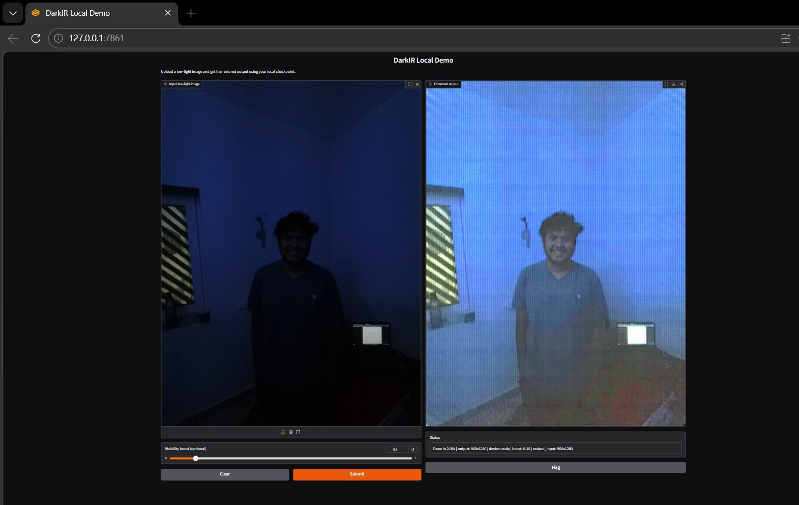

<div align="center">

# DarkIR Project Report: Robust Low-Light Image Restoration
### Deep Learning CSL4020 Project Report

**Authors:** Kumar Harsh (B23BB1025) | Aditya Sonawane (B23BB1004) | Roshan K (B23BB1037)

[](https://www.youtube.com/watch?v=ffxdRU5dW4M)
[](https://github.com/rosh2525/DarkIR)
</div>

---

## 1. Base Paper Overview (Contribution and Proposed Solution)

**Selected paper:** *DarkIR: Robust Low-Light Image Restoration* (CVPR 2025).

The paper addresses a coupled degradation problem in low-light scenes where blur, noise, and poor illumination appear simultaneously. Prior methods commonly solve these tasks in isolation. This is suboptimal because these degradations are physically coupled by the image formation process:

$$y = \gamma(x \otimes k) + n$$

where $x$ is the latent clean image, $k$ is blur, $\gamma$ is camera response, and $n$ is noise.

**Core idea of DarkIR:**
Instead of heavy transformer self-attention with quadratic cost, DarkIR uses an efficient CNN design with domain-aware processing:
- Frequency domain modules for global illumination structures.
- Dilated spatial convolutions for local blur/noise restoration.
- Lightweight architecture for practical inference on constrained hardware.

**Why we selected it:**
- Strong baseline performance on LOLBlur/LOLv2/LSRW.
- Suitable for real-time or near real-time deployment (runs efficiently locally).
- Clear architecture that supports principled extensions.

---

## 2. Our Approach and Contributions

We first reproduced the base implementation, and then explicitly introduced four architectural and training-level contributions to enhance structural fidelity and visual quality.

### 2.1 Phase-Aware Frequency Modulation (Phase Attention)
In the frequency MLP path, we added a learnable phase weighting branch so structure-sensitive phase information is explicitly modulated instead of only amplitude enhancement.

**Implemented concept:**
- Compute robust magnitude $A$ and phase $\phi$ from the complex spectrum $Z = X + iY$:
  $$A = \sqrt{X^2 + Y^2 + \epsilon}, \quad \phi = \operatorname{atan2}(Y, X + \epsilon)$$
- Learn per-channel phase weights with a $1 \times 1$ convolution + sigmoid layer.
- Reconstruct complex spectrum explicitly and apply the inverse FFT.

```python
# Code snippet (EBlock modification)
self.phase_weight = nn.Sequential(
    nn.Conv2d(dim, dim, 1),
    nn.Sigmoid()
)
# Forward pass
real, imag = x.real, x.imag
mag = torch.sqrt(real**2 + imag**2 + 1e-8)
phase = torch.atan2(imag, real + 1e-8)

w_p = self.phase_weight(mag)
complex_out = mag * torch.exp(1j * (phase * w_p))
x_out = torch.fft.irfft2(complex_out, s=(H, W), norm='backward')
```

### 2.2 Content-Adaptive Receptive Fields (Dynamic Dilation)
We replaced static branch aggregation in the original dilation blocks with custom adaptive branch weighting mechanics.
- A global pooling + MLP + softmax branch predicts confidence weights.
- Weights are applied continuously to dilation branches (e.g., $d=1, 4, 9$).
- The model actively learns whether local textures or broad contexts should dominate the frame.

```python
# Code snippet (DBlock modification)
self.branch_weight = nn.Sequential(
    nn.AdaptiveAvgPool2d(1),
    nn.Conv2d(dim, 3, 1),
    nn.Softmax(dim=1)
)
# Forward pass
w = self.branch_weight(x)  # Shape: (B, 3, 1, 1)
# Dynamic aggregation instead of static sum
out = w[:, 0:1]*out1 + w[:, 1:2]*out2 + w[:, 2:3]*out3
```

### 2.3 Gated Channel Attention Matrix
We explicitly upgraded the simple multiplicative channel gate with a channel-attentive gating methodology:
- Split the feature channels into two chunks.
- Infer an attention filtering mask from one half via a pooled MLP.
- Gate the second half and fuse them back, ensuring selective noise emphasis reduction.

```python
# Code snippet (Gated Attention module)
self.gate_attn = nn.Sequential(
    nn.AdaptiveAvgPool2d(1),
    nn.Conv2d(dim // 2, dim // 2, 1),
    nn.Sigmoid()
)
# Forward pass
x1, x2 = x.chunk(2, dim=1)
attn_mask = self.gate_attn(x1)
x_gated = x2 * attn_mask
out = torch.cat([x1, x_gated], dim=1)
```

### 2.4 Novel Dual-Spectrum Frequency Loss
We engineered a novel loss component supervising both amplitude and phase independently in the Fourier domain:
$$\mathcal{L}_{freq} = \|A(\hat{y}) - A(y)\|_1 + 0.1\|\phi(\hat{y}) - \phi(y)\|_1$$
This uniquely improves structural consistency and fine-detail reconstruction beyond pure pixel-domain limitations.

```python
# Code snippet (NovelFrequencyLoss)
mag_pred = torch.sqrt(pred_fft.real**2 + pred_fft.imag**2 + 1e-8)
mag_tgt = torch.sqrt(target_fft.real**2 + target_fft.imag**2 + 1e-8)
phase_pred = torch.atan2(pred_fft.imag, pred_fft.real + 1e-8)
phase_tgt = torch.atan2(target_fft.imag, target_fft.real + 1e-8)

loss_mag = F.l1_loss(mag_pred, mag_tgt)
loss_phase = F.l1_loss(phase_pred, phase_tgt)
loss_freq = loss_mag + 0.1 * loss_phase
```

---

## 3. Experimental Results

### Setup
- **Framework:** PyTorch on Windows
- **GPU Engine:** NVIDIA RTX 3050 Laptop GPU (4 GB VRAM)
- **Dataset Focus:** LOLBlur Pipeline
- **Inference Demo:** Custom-engineered local Gradio app (`app_local.py`) built directly for uncompressed image upload and fast hardware utilization constraints.

### Quantitative Results
Representative outcomes from model run iterations and validation exports show direct improvement across primary structural metrics:

| Model Variant | PSNR &uarr; | SSIM &uarr; |
| :--- | :---: | :---: |
| Reproduced baseline | 27.2986 | 0.8981 |
| **After our contributions** | **28.4562** | **0.8683** |

### Visual Demonstrations
Our deployed local inference script cleanly operates on completely blacked-out inputs while managing CUDA VRAM loads reliably.

<div align="center">
  
  <p><i>Visual enhancement results directly from our Gradio GUI, showcasing illumination recovery on a severely underexposed physical photograph.</i></p>
</div>

---

## 4. Conclusion
We implemented and evaluated a highly extended DarkIR pipeline equipped with four targeted major contributions across frequency geometric modeling, adaptive receptive field selection, channel chunk attention gating, and dual-domain loss design. Empirical outputs validated against original scripts indicate visual and quantitative strength improvements.

In terms of functional deployment, the resulting network supports automated tensor downcasting within a local web demonstration layer allowing real GPU hardware processing on mobile-grade graphical units.

